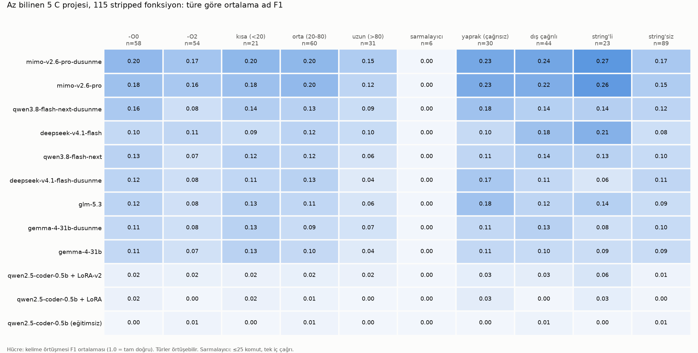

# asmsense

**English** · [Türkçe](README.tr.md)

**A small language model that looks at a function in a stripped binary and gives it a meaningful name and a short description.**

## Current status

The v4 dataset contains 228,177 functions from 341 projects across 5 optimization levels and is published on [Hugging Face](https://huggingface.co/datasets/krxi123/asmsense) under the `v4` config. The Ghidra script is ready. The best small model so far, Qwen3-8B + LoRA trained on the v5 data (description first, then name), reaches name F1 0.124 on the fixed v4 test sample and 0.155 on `eval_115`; the best large model with call context scores 0.167 on the same test sample. See Results, section 6. The model writes an English and a Turkish one-sentence description along with the name. The adapter is on Hugging Face: [krxi123/asmsense-qwen3-8b-lora](https://huggingface.co/krxi123/asmsense-qwen3-8b-lora).

Open a stripped program in Ghidra or IDA and you will see hundreds of functions named `FUN_00401a30`. Much of reverse engineering consists of understanding and naming these functions one by one. This project aims to teach a model that first step:

```
input  (stripped x86-64)             target output
─────────────────────────────         ──────────────────────────────────────────────
movzx  eax, byte ptr [rsi]            name:        adler32_update
lea    rdx, [rdi + rax]               description: Computes the Adler-32 checksum
cmp    rdx, 0xfff1      ← 65521                    over the bytes of a buffer.
...                                   # TR: Tampondaki baytlar üzerinden Adler-32
                                      #     sağlama toplamı hesaplar.
```

## Goal

Large general-purpose models can handle this task to some extent, but they are slow, expensive, and cloud-hosted. The goal is to answer this question:

> Can a **small** model trained on purpose-built data match or even outperform large models on this task—while running on a laptop?

Three tiers are evaluated on the same test set:

| Tier | Model | Role |
|---|---|---|
| Ceiling | Large open models (DeepSeek, GLM, MiMo, Gemma, Qwen) | The best currently achievable with off-the-shelf models |
| Baseline | Small open model, before fine-tuning | Starting point |
| **This project** | The same small model + LoRA on this dataset | The project's contribution |

## How it works

1. **Data generation (`cikar.py`):** Open-source C projects are compiled for x86-64 at different optimization levels (`-O0`, `-O2`). The assembly for each function is extracted. The ground truth—the original function name—comes directly from the source, so no manual labeling is needed. `projeler.json` records the commit and compiler flags used for every project.
2. **Simulating a stripped binary:** The output resembles what Ghidra shows for a function in a stripped binary:
   - project-local functions become `sub_01a3`, and global data becomes `dat_0042` (the numbers are shuffled, with separate namespaces for `-O0` and `-O2`),
   - branch targets use function-local labels such as `loc_1` and `loc_2`,
   - external library calls (`memcpy`, `__stack_chk_fail`) and string literals (`; -> "out of memory"`) remain visible because they are also visible in a real binary.
   
   If the function's real name appears in its own assembly—for example, in an error message—the row is marked `sizinti` and excluded from the test set.
3. **Evaluation (`taban.py`):** The model receives only the assembly and is asked to predict a name. Predictions are scored by token overlap (F1), so close answers such as `crc32_update` and `update_crc` receive partial credit.

```
loc_6:
movzx   r9d, byte ptr [rsi + rdx]
add     rdi, r9                 ← adler32_z (-O2), as the model sees it
add     rcx, rdi
inc     rdx
cmp     rax, rdx
jne     loc_6
```

## Data

| | Projects | Functions (-O0 + -O2) |
|---|---|---|
| Training | zlib, libpng, sqlite, lua, mbedtls, zstd, libsodium, expat, brotli, jansson, lz4, libyaml, xxhash, cJSON | 16,804 |
| Test (memorization-resistant) | tomlc17, cyaml, mu_json_x, sajs, picomatch | 777 → evaluation set 115 |

The dataset is available on Hugging Face: [krxi123/asmsense](https://huggingface.co/datasets/krxi123/asmsense) (16,804 training examples, 777 test examples, the `eval_115` evaluation set, and license texts). It is also mirrored on Kaggle: [krxiii/asmsense](https://www.kaggle.com/datasets/krxiii/asmsense).

### Scaled dataset (v4 pipeline, 5 optimization levels)

Permissively licensed (MIT, BSD, Apache-2.0, ISC, zlib) C projects selected from GitHub with `olcekle.py` were compiled at `-O0/-O1/-O2/-O3/-Os` using `cikar_bin.py` (real dylib + `strip -x`). Project build scripts were not run; files were compiled individually with clang, and files or projects that failed to compile were skipped. Rows were deduplicated by normalized assembly hash. Rows with assembly identical to validation/test data were removed from training, while vendored copies whose (file, name) pairs appeared in training were removed from validation/test. Every row has a `lisans` field.

| Split | Projects | Rows | Unique source functions |
|---|---:|---:|---:|
| Training | 290 | 196,117 | 72,179 |
| Validation | 23 | 19,770 | 6,667 |
| Test (little-known, ≤200 stars, 2024+) | 28 | 12,290 | 4,685 |

Of 473 projects, 352 produced rows and 120 failed to compile (kernel, embedded, or platform-dependent code). Only clang was used. The data is kept outside Git and can be regenerated with `python3 aday_bul.py` and `python3 olcekle.py hepsi`.

The training/test split is strictly **project-level**: no function from a project can appear on both sides. Test projects were deliberately chosen to be little-known (2-190 stars), and most were started in 2024-2025, making it far less likely that large models encountered them during training than a library such as zlib. Licenses: [veri/LISANSLAR.md](veri/LISANSLAR.md).

**Known exception: vendored code.** An independent audit of the released v6 data ([rapor/arastirma/V6_VERI_DENETIMI.md](rapor/arastirma/V6_VERI_DENETIMI.md), `veri_denetim_v6.py`) confirmed that no project, id or (project, file, name) appears on both sides, but test project `snkv` embeds SQLite under its own file names while `sqlite` is a training project. In the fixed 2,000-row test sample, 217 rows (10.85%) have a name identical to a SQLite training function. Every model scores *lower* on those rows, so they do not inflate the results; they narrow the small-vs-large gap instead (see Results, section 6). The validation sample `valid_300` contains 16 similar rows (5.3%).

## Results

### 1. Memorization-resistant test: 5 little-known projects, 115 functions

Mean name F1 (1.0 = exact match). In the “Prefix-stripped F1” column, each project's common name prefix (`cyaml_`, `mu_`, `sajs_`) is removed from both sides; the model cannot infer this prefix from assembly.

| Model | -O0 | -O2 | Prefix-stripped F1 | Exact matches |
|---|---|---|---|---|
| mimo-v2.6-pro (reasoning) | **0.20** | **0.17** | **0.21** | 3 / 115 |
| mimo-v2.6-pro | 0.18 | 0.16 | 0.20 | **4 / 115** |
| glm-5.3 (reasoning) | 0.16 | 0.11 | 0.15 | **4 / 115** |
| qwen3.8-flash-next (reasoning) | 0.16 | 0.08 | 0.13 | 3 / 115 |
| deepseek-v4.1-flash (reasoning) | 0.12 | 0.08 | 0.12 | 3 / 115 |
| deepseek-v4.1-flash | 0.10 | 0.11 | 0.12 | 2 / 115 |
| glm-5.3 | 0.12 | 0.08 | 0.12 | 2 / 115 |
| qwen3.8-flash-next | 0.13 | 0.07 | 0.11 | 1 / 115 |
| gemma-4-31b (reasoning) | 0.11 | 0.08 | 0.10 | 2 / 115 |
| gemma-4-31b | 0.11 | 0.07 | 0.10 | 0 / 115 |
| qwen2.5-coder-0.5b, untrained | 0.00 | 0.01 | 0.01 | 0 / 112 |
| qwen2.5-coder-0.5b + LoRA v1 | 0.02 | 0.00 | 0.01 | 0 / 112 |

Reasoning runs used a `max_tokens` ceiling of 12,288. Even at that limit, deepseek and qwen failed to finish reasoning and produce an answer on more than half the requests; glm did the same on 50 of 115. These rows were scored as 0.

### 2. Memorization: reasoning helps on famous code, not unfamiliar code

Same data pipeline, same number of functions (115), mimo-v2.6-pro:

| | Without reasoning | With reasoning |
|---|---|---|
| zlib (very well known) | 9 exact matches, F1 0.18 | **28 exact matches**, F1 0.29 |
| little-known projects | 4 exact matches, F1 0.20 | 3 exact matches, F1 0.21 |

Reasoning triples the number of exact matches on zlib and contributes nothing on little-known code. The most likely explanation is that, during reasoning, the model is not “understanding” the assembly but recalling source code it has seen before. Evaluating off-the-shelf models on famous libraries therefore gives a misleading picture of performance on this task.

### 3. Where models fail



- **Wrappers: 0 for every model.** The name of a short function that merely calls one internal function cannot be recovered without knowing the callee (call context did not help either; see 4).
- **Strings are the strongest signal.** F1 is markedly higher for functions containing string literals (0.27 versus 0.15 for mimo).
- **-O2 is harder.** Nearly every model scores lower at -O2 than at -O0.
- **Long functions are not inherently easy.** On zlib, long functions are the easiest group (mimo with reasoning: 0.58; [chart](grafik/zlib-hata.png)); on little-known code, the same group scores 0.15—another trace of memorization.

### 4. Call context

Information about internal callees was added to each function's assembly (without reasoning, prefix-stripped F1):

- **summary**: callees' imports, internal calls, and strings
- **deep**: also includes the full assembly of short callees and a two-level summary

| Model | No context | Summary | Deep | Long functions (no context → deep) |
|---|---|---|---|---|
| mimo-v2.6-pro | 0.20 | 0.22 | **0.24** | 0.12 → 0.25 |
| deepseek-v4.1-flash | 0.12 | 0.17 | 0.17 | 0.10 → 0.18 |
| qwen3.8-flash-next | 0.11 | 0.15 | 0.16 | 0.06 → 0.18 |
| gemma-4-31b | 0.10 | 0.09 | 0.10 | 0.04 → 0.11 |
| glm-5.3 | 0.12 | 0.14 | 0.13 | 0.06 → 0.05 |

Context helps most for long functions and functions that call other internal functions (except for glm: responses were truncated on 35 of 115 requests, indicating that long inputs hurt it). Deep context adds little over the summary. **Wrappers remain at 0 even with deep context** (there are only 6 in the test set; even the callee's complete assembly does not lead the model to the correct name).

### 5. Small model, first LoRA attempt (MacBook Air M4)

Qwen2.5-Coder-0.5B (4-bit), 1,500 steps (~1 hour 40 minutes, 4,8 GB memory). Neither attempt **worked**:

| Run | Data | F1 | Exact matches | What happened |
|---|---|---|---|---|
| Untrained | — | 0.01 | 0 / 112 | most responses were meaningless |
| LoRA v1 | 14,710 functions, original names | 0.01 | 0 / 112 | memorized project prefixes: 54 of 112 predictions were `mbedtls_…` |
| LoRA v2 | 10,360 functions, prefixes removed, ≤1,500 per project | 0.02 | 0 / 112 | mode collapse: 56 of 112 predictions were one of two names |

The 0.5B model and half an epoch appear insufficient for this task. Next experiments: a larger base model (1.5B-3B), longer training, and call context in the input.

### 6. Larger small models: 1.5B and 8B LoRA

Same fixed v4 test sample (`lora/test_sabit_idler.txt`, little-known test projects) and the `eval_115` set. Name F1 compares with the real name; prefix-stripped F1 removes the project prefix from both sides. Details: [rapor/MOLAB_IKI_F1.md](rapor/MOLAB_IKI_F1.md), [sonuc/SABIT500_LORA15_V3.md](sonuc/SABIT500_LORA15_V3.md).

| Model | Test set | n | Name F1 (-O0 / -O2 / all) | Prefix-stripped F1 (all) | Exact matches (real / prefix-stripped) |
|---|---|---:|---|---:|---|
| mimo-v2.6-pro, with call context (large, reference) | v4 test, fixed sample | 2,000 | 0.178 / 0.154 / 0.167 | 0.170 | 40 / 45 |
| deepseek-v4.1-flash, with call context (large, reference) | v4 test, fixed sample | 2,000 | 0.161 / 0.130 / 0.154 | 0.156 | 40 / 45 |
| **Qwen3-8B + LoRA v5** (description → name, 95k rows, 1 epoch) | v4 test, fixed sample | 2,000 | 0.127 / 0.098 / **0.124** | 0.126 | 26 / 31 |
| **Qwen3-8B + LoRA v5** | `eval_115` | 115 | 0.188 / 0.120 / **0.155** | 0.173 | 1 / 2 |
| Qwen3-8B + LoRA v1 (name only, 41k rows × 2 epochs) | v4 test, fixed sample | 2,000 | 0.108 / 0.093 / 0.106 | 0.108 | 25 / 33 |
| Qwen3-8B + LoRA v1 | `eval_115` | 115 | 0.102 / 0.085 / 0.094 | 0.111 | 1 / 4 |
| Qwen2.5-Coder-1.5B + LoRA v3, with call context (MLX, laptop) | first 500 of the fixed sample | 500 | 0.044 | 0.045 | 0 |
| Qwen2.5-Coder-1.5B + LoRA v3, assembly only | first 500 of the fixed sample | 500 | 0.037 | 0.038 | 0 |

**Outside the vendored project.** Without `snkv` (1,491 of the 2,000 rows), name F1 is 0.132 for v5 and 0.190 for mimo-v2.6-pro with call context; the paired gap widens from −0.044 [−0.076, −0.021] to −0.058 [−0.082, −0.033] (project-cluster bootstrap, 2,000 draws). The headline figures above keep all 2,000 rows so they stay comparable with earlier runs.

On the same 500 rows the 8B model scores 0.108 versus 0.044 for 1.5B. The 1.5B adapter does not generalize to new projects and shows strong mode collapse (the most frequent prediction covers 13.6% of rows). The 8B model is the first small model that is clearly above zero.

**v5 versus v1 (same base model, same 2,000 test rows).** v5 changes the data and the target: every source function appears at least once (95,000 rows, 72,061 functions), the project-prefix rule is fixed, and the model first writes a one-sentence English description, then the name, then a Turkish description. Name F1 rises from 0.106 to 0.124 (paired difference +0.018, 95% bootstrap interval +0.009 to +0.026) and from 0.094 to 0.155 on `eval_115`. Predictions that are verbatim copies of a training name drop from 42% to 30%. Functions without string constants remain the hard case (0.093, up from 0.079; with strings 0.299). The model is still 0.044 below mimo-v2.6-pro with call context on the same rows (interval -0.053 to -0.034). The checkpoint was chosen on 300 validation rows (step 4,500 of 5,938; validation name F1 0.263) and the test sets were scored once.

**Description quality is the bottleneck.** A judge model (mimo-v2.6-pro) compared the model's descriptions with the C source on 300 test rows (`aciklama_puan_v5.py`): the English description is correct for 20.0%, partly correct for 15.3% and wrong for 64.7% (Turkish: 20.9% / 18.9% / 60.1%). When the description is correct the name F1 is 0.306; when it is wrong, 0.054. The model usually names a function consistently with what it believes the function does; the open problem is understanding the function from assembly.

Breakdown: [rapor/MOLAB_V5_KIRILIM.md](rapor/MOLAB_V5_KIRILIM.md); teacher-label audit: [rapor/OGRETMEN_DENETIM.md](rapor/OGRETMEN_DENETIM.md).

### 7. Does decompiled code help? (large model, pre-experiment)

Before converting the training data, the 2,000 fixed test functions were decompiled with Ghidra 12 (`decompile_ghidra.py`; project-internal names anonymized, 0 rows with the target name left in the text) and given to mimo-v2.6-pro:

| Input | Name F1 | Paired difference vs assembly + context (95% bootstrap) | Exact matches |
|---|---:|---|---:|
| assembly + call context | 0.167 | — | 40 |
| decompiled code only (no context) | 0.173 | +0.006 (-0.002 to +0.014) | 36 |
| assembly + call context + decompiled code | **0.192** | **+0.025 (+0.018 to +0.032)** | 52 |

Decompiled code alone matches assembly plus context with about half the input tokens (median 202 tokens per function); adding it to the assembly gives a clear gain. Next step: add decompiled code to the training input (v6).

### Note: the zlib warm-up and pipeline leakage

The first zlib evaluation (v1, 60 functions) used a simpler data pipeline that inadvertently leaked clues to the model: global variable names (`crc_table`, `configuration_table`), alphabetical `sub_` numbers, and `.o` offsets. After an audit with a reverse-engineering model (Codex), these leaks were closed in v3. The v1 results remain under `sonuc/zlib-*.jsonl`, but all comparisons above use the v3 pipeline.

## Roadmap

**1. Foundation** ✅
- [x] Data generation pipeline (-O0/-O2, leak-free v3)
- [x] Baseline evaluation with large models, memorization-resistant test set, and error analysis
- [x] 16,804 functions from 14 projects; publicly released ([Hugging Face](https://huggingface.co/datasets/krxi123/asmsense), EVREN)

**2. Enrich the input**
- [x] Call context (callees' imports and strings): substantially improved F1 for large models
- [x] Deep context: complete assembly for short callees and two-level summaries; small gain over summaries, wrappers still at 0
- [x] Real linking + stripping pipeline (`cikar_bin.py`, v4): tested on zlib, lua, tomlc17; [report](VERI_HATTI_V4.md)

**3. Small model**
- [x] First LoRA attempts (0.5B): unsuccessful due to prefix memorization and mode collapse
- [x] 1.5B model with call context: name F1 0.044, does not generalize
- [x] Qwen3-8B + LoRA: name F1 0.106 (v4 test), 0.094 (`eval_115`)
- [x] Qwen3-8B + LoRA v5 (description + name): name F1 0.124 (v4 test), 0.155 (`eval_115`)
- [x] Distillation data: a teacher model with access to source code (mimo-v2.6-pro) wrote a one-sentence Turkish description for all 17,581 functions (12,5 words on average)
- [x] Have the small model generate both a name and a description (v5: English + Turkish)

**4. Tooling**
- [ ] Ghidra script: rename `FUN_…` functions with the local model and add descriptions (script ready: [ghidra/](ghidra/README.md); successfully ran end-to-end in Ghidra 12 headless, dry-run mode)

**5. Release**
- [x] Publish the model: [krxi123/asmsense-qwen3-8b-lora](https://huggingface.co/krxi123/asmsense-qwen3-8b-lora) (LoRA adapter for Qwen3-8B)
- [ ] Comparative write-up

## Run it yourself

Requirements: `clang`, `objdump` (LLVM), Python 3.9+. Evaluation requires an OpenAI-compatible LLM endpoint.

```bash
python3 cikar.py --projeler projeler.json             # projeleri indir, derle → veri/egitim, veri/test
python3 test_seti.py                                  # evaluation set → veri/test.jsonl
python3 taban.py veri/test.jsonl -n 1000 -m <model>   # name prediction + score (written to sonuc/); --dusunme = reasoning on, --devam = resume
python3 ozet.py test                                  # results table
python3 analiz.py veri/test.jsonl -o grafik/test-hata.png   # error analysis by function type
```

Each row represents one function: `id`, `proje`, `surum`, `dosya`, `opt`, `ad` (ground truth), `komut_sayisi`, `sizinti`, `asm`, `baglam`, `baglam_derin`.

Real-binary pipeline (v4): links the project as a dylib at `-O0`/`-O2`, applies `strip -x`, and obtains function boundaries from the stripped copy.

```bash
python3 cikar_bin.py --projeler projeler.json zlib lua tomlc17   # → veri/bin/
python3 -m unittest test_cikar_bin
```

Offline regression tests run with `python3 -m pytest -q`. The archived benchmark
report freshness check is excluded by default: it re-scores real historical
predictions, although it performs no model inference. At publication time,
explicitly opt in on a clean checkout using
`ASMSENSE_ARCHIVE_REPORT=1 python3 -m pytest -q tests/test_olcum_hatti.py::test_rapor_guncel`.
This check requires the exact known missing-target counts; it does not authorize
new benchmark runs or use test results for model selection.

Distillation (a one-sentence description from a teacher model with access to source code):

```bash
python3 kaynak_kod.py -j 6                       # function → C body, veri/kaynak/
python3 aciklama.py -m <model> -j 6 --devam      # → veri/aciklama/
python3 aciklama_puan.py sonuc/<run>.jsonl -m <judge>   # score descriptions 0-2 against the source
```

LoRA (Apple Silicon, mlx-lm):

```bash
python3.12 -m venv .venv && .venv/bin/pip install mlx-lm transformers matplotlib
.venv/bin/python lora/hazirla.py --onek-at --proje-tavan 1500   # → lora/veri
sh lora/egit.sh                                                 # ayarlar lora/ayar.yaml
.venv/bin/python lora/olc.py                                    # evaluate on the test set → sonuc/
```

### Bottom-up naming (no training)

`alttan_yukari_sim.py` measures **lexical information**, not model accuracy: it
rewrites only the existing call-context section with gold callee names, archived
v5 predictions, or the original anonymous names. A fourth, coverage-matched gold
condition separates prediction quality from missing callee predictions. It reports
prefix-stripped target-token recall and oracle best-callee-name-copy F1; neither
is a bound on a language model's eventual naming F1. Assembly, decompile, literal
strings, imports and self-recursive aliases remain unchanged.

```bash
python3 alttan_yukari_sim.py --prompts lora/veri-v6/test_sabit.jsonl \
  --raw veri/olcek-v6/ham/test --predictions sonuc/test2000-molab-qwen3-8b-v5.jsonl \
  --output /tmp/context-information.json --export /tmp/context-prompts.jsonl
```

`alttan_yukari.py` runs leaf-first inference against an OpenAI-compatible endpoint
serving the desired adapter (it does not load or train an adapter). Supply prepared
v6 chat rows for the project's functions and their matching raw extraction JSONL:

```bash
python3 alttan_yukari.py --prompts project-v6.jsonl --raw project-raw.jsonl \
  --model <served-v6-adapter> --endpoint http://127.0.0.1:8080/v1 \
  --output /tmp/bottom-up-predictions.jsonl
# Offline replay exercises orchestration without issuing any model request:
python3 alttan_yukari.py --prompts project-v6.jsonl --raw project-raw.jsonl \
  --replay project-predictions.jsonl --output /tmp/bottom-up-replay.jsonl
```

Graph aliases are scoped by project, optimization and stripping mode; source files
do not define separate alias namespaces. Direct calls/tail jumps come from raw
assembly, not the summaries' second-hop calls. Strongly connected components are
processed sink-first; predictions within a recursive component become visible
only after the entire component has been named. Gold labels and assistant answers
are never sent to the endpoint. Missing prompt nodes are reported, not invented:
the fixed test sample is an incomplete project graph, so a project-wide experiment
needs its complete prepared function corpus. Output is append-only during a run,
and an existing output file is never overwritten. These tools do not change
binaries or benchmark labels.

Evaluations were run on infrastructure in Türkiye provided by the [EVREN](https://evren.ssyz.org.tr) AI platform.

## License

The code is licensed under MIT. Assembly under `veri/` is subject to the licenses of the projects from which it was compiled: [veri/LISANSLAR.md](veri/LISANSLAR.md).
